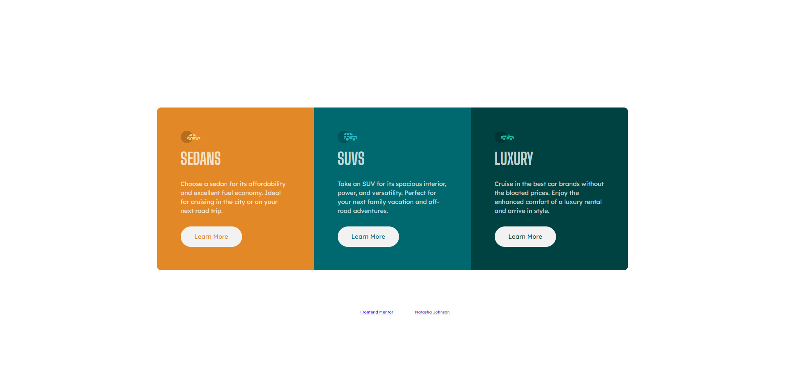
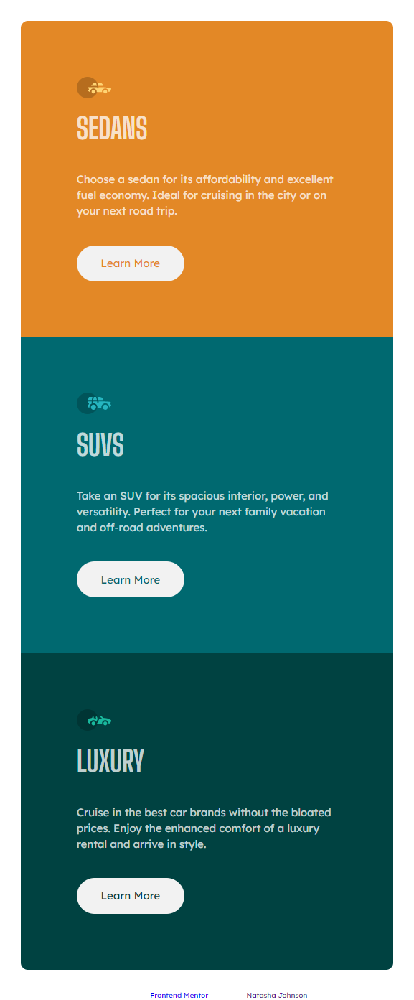

# Frontend Mentor - 3-column preview card component solution

This is a solution to the [3-column preview card component challenge on Frontend Mentor](https://www.frontendmentor.io/challenges/3column-preview-card-component-pH92eAR2-). Frontend Mentor challenges help you improve your coding skills by building realistic projects. 

## Table of contents

- [Overview](#overview)
  - [The challenge](#the-challenge)
  - [Screenshot](#screenshot)
  - [Links](#links)
- [My process](#my-process)
  - [Built with](#built-with)
  - [What I learned](#what-i-learned)
  - [Continued development](#continued-development)
- [Author](#author)

**Note: Delete this note and update the table of contents based on what sections you keep.**

## Overview

This was the 3-column preview card component challenge from Frontend Mentor.

### The challenge

Users should be able to:

- View the optimal layout depending on their device's screen size
- See hover states for interactive elements

### Screenshot

### Links

- Solution URL: [Add solution URL here](https://github.com/njohnson533/3-column-preview-card-component-challenge.git)
- Live Site URL: [Add live site URL here](https://njohnson533.github.io/3-column-preview-card-component/)

## My process

I used a mobile first design and broke the example picture into sections to figure out the structure needed.  I used a wrapper class and then 3 identical subsections.  I used CSS Grid so I wouldnt need to use media queries.

### Built with

- HTML 5
- CSS custom properties
- Flexbox
- CSS Grid
- Mobile-first workflow

### What I learned

How to use auto-fit with the repeat function in CSS Grid.

### Continued development

I need to continue to work on CSS Grid.  

## Author
- Frontend Mentor - [@njohnson533](https://www.frontendmentor.io/profile/njohnson533)

